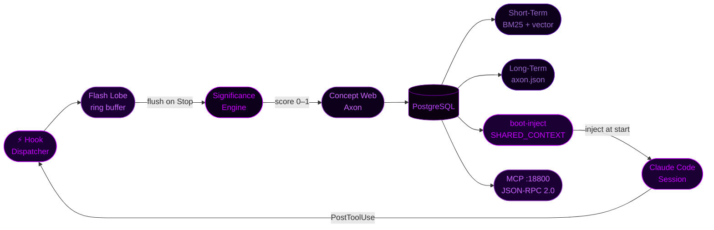

<div align="center">


<br/>

[](https://git.io/typing-svg)

<br/>


</div>

---

```
╔══════════════════════════════════════════════════════════════════════════════╗
║  🧠  THEOREX — PERSISTENT SELF-IMPROVING MEMORY FOR AI AGENTS  🧠           ║
║                                                                              ║
║  3-lobe cognitive architecture: Flash → Significance Engine → Concept Web.  ║
║  Semantic decay. Memory promotion. Boot injection. Closed learning loop.    ║
║  The reasoning core behind Sovereign-Allocator, Nova, and every agent.     ║
╚══════════════════════════════════════════════════════════════════════════════╝
```

<br/>

## > WHAT_IT_DOES.exe

Theorex gives AI agents **persistent, self-improving memory** that survives across sessions. Not a simple chat log. A live concept graph that decays, promotes, and injects itself into every new session — so agents remember what matters, forget what doesn't, and get smarter every cycle.

```
Without Theorex:  Each session starts blank. Same mistakes. Same lookups. No growth.
With Theorex:     Agent boots with its 50 most relevant concepts injected.
                  Wins reinforce patterns. Losses write trace_fix concepts.
                  3am cron runs evolve-review. Session N+1 is smarter than N.
```

---

## > ARCHITECTURE.exe



---

## > MEMORY_PIPELINE.exe

```
Claude Code session (tool call)
       │
       │  SpanStore.emitSpan()
       │  TokenJuice compression (~60–80% token reduction)
       ▼
  agent_spans (Postgres · FTS5-indexed · searchable by session)
       │
       │  3am OC cron: theorex evolve-review --agent all
       ▼
  concepts (enriched via enrich_bodies · promoted via scan)
       │
       │  theorex boot-inject
       │  Postgres → semantic grouping → palace structure
       ▼
  ~/.openclaw/workspace/theorex/SHARED_CONTEXT.md
       │
       └──► injected at every new session start
```

**Boot inject groups concepts by palace structure:**
```
## 🟢 Wins       (ACTIVE, score ≥ 0.6)
## 🔴 Losses     (ACTIVE, score ≥ 0.6)
## 🟡 Identity   (MILD,   score ≥ 0.3)
```

---

## > THREE_LOBES.exe

<details>
<summary><strong>▶ Flash Lobe — per-session ring buffer</strong></summary>

```
Captures every tool call and stop event via Claude Code hooks.
Writes to ~/.theorex/flash/{session-id}.jsonl
Flushes to Significance Engine on session stop.
Not for retrieval — for presence. "What happened this session?"
```

</details>

<details>
<summary><strong>▶ Short-Term Lobe — 14-day rolling window</strong></summary>

```
BM25 + vector hybrid search (RRF fusion)
Stores last 14 days of concept events
Graduates qualifying concepts → Long-Term Lobe
BM25 via Postgres FTS5 tsvector column (auto-populated)
Vector via nomic-embed-text-v1.5 through LM Studio
```

</details>

<details>
<summary><strong>▶ Long-Term Lobe — permanent knowledge</strong></summary>

```
axon.json — concept graph with edge weights
Moment nodes — permanent episodic anchors
Decay: exponential, halflife 14 days (configurable)
Promotion threshold: composite score ≥ 0.5
ACTIVE tier: score ≥ 0.6 | MILD: ≥ 0.3 | LESS: < 0.3
```

</details>

---

## > LEARNING_LOOP.exe

```
theorex dispatch(task, {outcome_id})
  ↓
LM_INFERENCE_START (trace_id = preGeneratedUUID)
  ↓
qwen-abliterated :8000 → success / failure
  ↓
LM_INFERENCE_END → EventBus → TraceRecord written
  ↓
patchOutcomeTraceId(outcome_id, trace_id)
  ↓
[3am OC cron] theorex evolve-review --agent all
  reviewOutcomes() + refineFromReport()
  reviewAllFailures() → trace_fix concepts written
  ↓
[OC cron] theorex promote + boot-inject
  trace_fix concepts in SHARED_CONTEXT.md at next session
  trace_fix half-life = 7 days
```

**Router priority chain:**
```
1. Role registry    — operative model_preference wins if query type matches
2. EnergyDispatch   — pmset battery check, large→medium below 20%
3. ConfidenceMatrix — empirical win-rate: 0.6×success + 0.4×(1−latency)
4. HeuristicRouter  — 7 keyword tiers: code·math·retrieval·synthesis·creative·safety·general
```

---

## > FLEET_GE.exe

<details>
<summary><strong>▶ Fleet-GE Signal Scanner — gene registry + GEP directives</strong></summary>

```bash
bun run src/ge/signal-scanner.ts --source watchdog
bun run src/ge/signal-scanner.ts --source pm2
bun run src/ge/signal-scanner.ts --source theorex
```

**Active gene registry:**
```
┌──────────────────────────────────────────────────────┬──────────┐
│  Gene                                                │ Priority │
├──────────────────────────────────────────────────────┼──────────┤
│  gene_divergence_win_rate_anomaly                    │  HIGH    │
│  gene_horizon_outcome_tracking                       │  HIGH    │
│  gene_singularity_position_cap                       │ CRITICAL │
│  gene_hades_turboquant_health_monitor                │  MEDIUM  │
│  gene_hades_watchdog_cooldown_race                   │  HIGH ✓  │
└──────────────────────────────────────────────────────┴──────────┘
```

Every GEP directive written to `evolution_events` with full audit trail.

</details>

---

## > MCP_SERVER.exe

JSON-RPC 2.0 HTTP server on `:18800` — exposes full axon read/write/search to any external tool or agent.

```bash
theorex mcp-start --port 18800 --agent main
```

| Method | Params | Description |
|---|---|---|
| `status` | — | agent name · concept count · top ACTIVE |
| `search` | `query: string` | FTS5 + vector hybrid search |
| `write` | `text: string` | extract concepts + write to axon |
| `search_spans` | `agent, query, limit?` | FTS5 span search across sessions |
| `boot-inject` | — | regenerate SHARED_CONTEXT.md |
| `retrieve_outcomes` | `agent, limit?` | read trade outcomes |
| `write_trade_outcome` | `outcome` | shadow a trade outcome |
| `write_learning` | `learning` | write structured lesson |
| `get_learnings` | `agent, context?` | query lessons |

---

## > CRON_SCHEDULE.exe

```
┌────────────┬──────────────────┬──────────────────────────────────────────┐
│  OC Cron   │  Schedule        │  Command                                 │
├────────────┼──────────────────┼──────────────────────────────────────────┤
│  c6bd399a  │  0 */4 * * *     │  fleet-ge-signal-scan                    │
│  10fd0f7d  │  0 3 * * *       │  theorex evolve-review (all agents)      │
│  4f7a8761  │  */5 * * * *     │  theorex-health-check                    │
│  66ddb18c  │  0 6 * * *       │  monitor-partitions (daily)              │
│  5b65a0c7  │  0 2 * * 0       │  security-sweep (weekly)                 │
└────────────┴──────────────────┴──────────────────────────────────────────┘
```

---

## > QUICKSTART.exe

```bash
git clone https://github.com/LORD-ZYTHOZ/Theorex
cd Theorex
bun install

# Write a concept
theorex write --agent main "TTL invalidation prevents cache stampedes"

# Search memory
theorex search "cache invalidation" --agent main

# Record a learning
theorex learn --agent nova --event decision \
  --context "direct LAN vs relay" \
  --pattern "direct LAN more reliable" \
  --outcome positive

# Run evolution cycle
theorex evolve-review --agent all

# Boot inject — rebuild session context from Postgres
theorex boot-inject --top 50 --depth summary

# Start MCP server
theorex mcp-start --port 18800 --agent main
```

---

## > CONFIG.exe

<details>
<summary><strong>▶ Key config.json parameters</strong></summary>

```json
{
  "TURBOQUANT_SEED": "42",
  "halfLifeDays": 14,
  "activeThreshold": 0.6,
  "mildThreshold": 0.3,
  "promotionThreshold": 0.5,
  "evolveWindowDays": 7,
  "THEOREX_STORAGE": "postgres",
  "lmStudioUrl": "http://localhost:11434"
}
```

> ⚠️ `TURBOQUANT_SEED` is baked into all 4320 stored TurboCode compressed vectors. Changing it invalidates ALL stored codes and requires full backfill.

</details>

---

## > STACK.exe

```
Runtime        Bun 1.3+
Storage        PostgreSQL — concepts · agent_spans · flash_events · outcomes · learnings
Semantic       nomic-embed-text-v1.5 via LM Studio (localhost:1234)
Full-text      Postgres FTS5 + ts_rank scoring
Compression    TokenJuice — ~60–80% token reduction on stored spans
Vector search  TurboQuant (ICLR 2026) — 4320 compressed embeddings via napi-rs
Large LLM      Qwen API — Qwen Max / Qwen3.5-122B-A10B
Background     qwen-abliterated :8000 — fire-and-forget inference
Protocol       JSON-RPC 2.0 MCP server :18800
Scheduling     OpenClaw cron (source of truth) · PM2 (theorex-scan only)
```

---

<div align="center">

<br/>

```
┌──────────────────────────────────────────────────────────────────┐
│  The reasoning core. Every agent runs on top of this.            │
│  Built in Sydney · Self-improving since day one                  │
└──────────────────────────────────────────────────────────────────┘
```

<br/>

MIT License · [Bun](https://bun.sh) · TypeScript · PostgreSQL

<br/>


</div>
