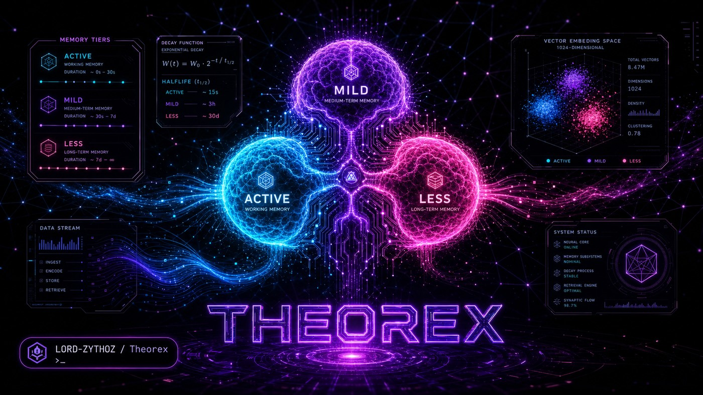

<div align="center">



</div>

<div align="center">

[](https://git.io/typing-svg)

</div>

<br/>

<div align="center">


</div>

---

<div align="center">

```
┏━━━━━━━━━━━━━━━━━━━━━━━━━━━━━━━━━━━━━━━━━━━━━━━━━━━━━━━━━━━━━━━━━━━┓
┃                                                                    ┃
┃   PERSISTENT SELF-IMPROVING MEMORY FOR MULTI-AGENT LLM SYSTEMS    ┃
┃                                                                    ┃
┃   3-lobe cognitive architecture  ·  semantic decay & promotion     ┃
┃   boot injection  ·  closed learning loop  ·  fleet signal bus     ┃
┃                                                                    ┃
┃   The reasoning core. Every agent runs on top of this.             ┃
┃                                                                    ┃
┗━━━━━━━━━━━━━━━━━━━━━━━━━━━━━━━━━━━━━━━━━━━━━━━━━━━━━━━━━━━━━━━━━━━┛
```

</div>

---

## `>` WHAT IT DOES

Theorex gives AI agents **persistent, self-improving memory** that survives across sessions — not a chat log, but a live concept graph that **decays, promotes, and injects** itself into every new session.

```
WITHOUT  →  Each session starts blank. Same mistakes. No growth.
WITH     →  Agent boots with its 50 most relevant concepts pre-injected.
             Wins reinforce. Losses write trace_fix concepts.
             3am cron runs evolve-review. Session N+1 is smarter than N.
```

---

## `>` ARCHITECTURE

<div align="center">

```
╔══════════════════════════════════════════════════════════════════════╗
║                    CLAUDE CODE SESSION                               ║
║                                                                      ║
║   [Hook Dispatcher]  ─────────────────────────────────────────►     ║
║   PostToolUse · Stop          inject at start ◄── [SHARED_CONTEXT]  ║
╚══════════════════════╤═══════════════════════════════╤══════════════╝
                       │ emitSpan()                    │ boot-inject
                       ▼                               │
╔══════════════════════════════════╗                   │
║        FLASH LOBE                ║                   │
║  per-session ring buffer         ║                   │
║  flush on Stop → Significance    ║                   │
╚══════════════════════╤═══════════╝                   │
                       │ scored concept events         │
                       ▼                               │
╔══════════════════════════════════╗                   │
║     SIGNIFICANCE ENGINE          ║                   │
║                                  ║                   │
║  ConceptExtractor                ║                   │
║       │                          ║                   │
║  ImportanceGate  (binary)        ║                   │
║       │                          ║                   │
║  FrequencyAmplifier  (log-norm)  ║                   │
║       │                          ║                   │
║  CompositeSignal  (0.0 → 1.0)   ║                   │
╚══════════════════════╤═══════════╝                   │
                       │                               │
                       ▼                               │
╔══════════════════════════════════════════════════════╧══════════════╗
║                   CONCEPT WEB  (Axon)  ·  PostgreSQL                ║
║                                                                      ║
║  CrossPollinator  ·  activation spreads through edge weights         ║
║  DecayRunner      ·  exponential decay on idle nodes                 ║
║  TierClassifier   ·  ACTIVE (≥0.6)  ·  MILD (≥0.3)  ·  LESS        ║
║                                                                      ║
║   concepts  ·  agent_spans  ·  flash_events  ·  outcomes            ║
╚══════════════════════╤══════════════════╤══════════════════╤════════╝
                       │                  │                  │
              ┌────────▼──────┐  ┌────────▼──────┐  ┌───────▼──────┐
              │ SHORT-TERM    │  │  LONG-TERM    │  │   MCP SERVER  │
              │ BM25 + vector │  │  axon.json    │  │   :18800      │
              │ 14-day window │  │  moment nodes │  │   JSON-RPC2.0 │
              └───────────────┘  └───────────────┘  └──────────────┘
```

</div>

---

## `>` MEMORY PIPELINE

```
Claude Code session  (tool call)
  │
  │  SpanStore.emitSpan()  ·  TokenJuice  (~60–80% compression)
  ▼
agent_spans  ──  PostgreSQL  ──  FTS5-indexed  ──  searchable by session
  │
  │  [3am OC cron]  theorex evolve-review --agent all
  ▼
concepts  ──  enrich_bodies  ──  scan  ──  promote
  │
  │  theorex boot-inject
  │  Postgres → semantic grouping → palace structure
  ▼
~/.openclaw/workspace/theorex/SHARED_CONTEXT.md
  │
  └──►  injected at every new session start
```

**Palace structure at inject time:**

| Wing | Tier | Score |
|---|---|---|
| 🟢 Wins | ACTIVE | ≥ 0.6 |
| 🔴 Losses | ACTIVE | ≥ 0.6 |
| 🟡 Identity | MILD | ≥ 0.3 |

---

## `>` THREE LOBES

<details>
<summary><b>⚡ Flash Lobe — per-session ring buffer</b></summary>

<br/>

```
Purpose   →  presence, not retrieval. "What happened this session?"
Writes    →  ~/.theorex/flash/{session-id}.jsonl
Trigger   →  PostToolUse + Stop hooks via Claude Code
Flush     →  on session Stop → Significance Engine
```

</details>

<details>
<summary><b>🔁 Short-Term Lobe — 14-day rolling window</b></summary>

<br/>

```
Search    →  BM25 + vector hybrid  (RRF fusion)
Window    →  14-day rolling JSONL log
Promotion →  qualifying concepts graduate → Long-Term Lobe
BM25      →  Postgres FTS5 tsvector  (auto-populated generated column)
Vector    →  nomic-embed-text-v1.5 via LM Studio
```

</details>

<details>
<summary><b>🧬 Long-Term Lobe — permanent crystallised knowledge</b></summary>

<br/>

```
Storage   →  axon.json  (concept graph with edge weights)
Nodes     →  Moment nodes — permanent episodic anchors
Decay     →  exponential, halflife 14 days (configurable)
Promotion →  composite score ≥ 0.5
Tiers     →  ACTIVE ≥ 0.6  |  MILD ≥ 0.3  |  LESS < 0.3
```

</details>

---

## `>` LEARNING LOOP

```
theorex dispatch(task, {outcome_id})
  │
  ├──  LM_INFERENCE_START  (trace_id = preGeneratedUUID)
  │
  ├──  qwen-abliterated :8000  →  success / failure
  │
  ├──  LM_INFERENCE_END  →  EventBus  →  TraceRecord written
  │
  ├──  patchOutcomeTraceId(outcome_id, trace_id)
  │
  │    [3am OC cron]  theorex evolve-review --agent all
  ├──  reviewOutcomes()  +  refineFromReport()
  ├──  reviewAllFailures()  →  trace_fix concepts written
  │
  │    [OC cron]  theorex promote  +  boot-inject
  └──  trace_fix in SHARED_CONTEXT.md  ·  half-life = 7 days
```

**Router priority chain:**

```
1  Role registry      model_preference wins if query type matches
2  EnergyDispatch     pmset battery check  ·  large→medium below 20%
3  ConfidenceMatrix   0.6 × success_rate  +  0.4 × (1 − latency)
4  HeuristicRouter    code · math · retrieval · synthesis · creative · safety · general
```

---

## `>` FLEET-GE SIGNAL SCANNER

<details>
<summary><b>Gene registry + GEP directives</b></summary>

<br/>

```bash
bun run src/ge/signal-scanner.ts --source watchdog
bun run src/ge/signal-scanner.ts --source pm2
bun run src/ge/signal-scanner.ts --source theorex
```

```
┌──────────────────────────────────────────────────────┬──────────┐
│  Gene                                                │ Priority │
├──────────────────────────────────────────────────────┼──────────┤
│  gene_divergence_win_rate_anomaly                    │  HIGH    │
│  gene_horizon_outcome_tracking                       │  HIGH    │
│  gene_singularity_position_cap                       │ CRITICAL │
│  gene_hades_turboquant_health_monitor                │  MEDIUM  │
│  gene_hades_watchdog_cooldown_race                   │  HIGH ✓  │
└──────────────────────────────────────────────────────┴──────────┘
```

Every GEP directive written to `evolution_events` with full audit trail.

</details>

---

## `>` MCP SERVER

JSON-RPC 2.0 on `:18800` — full axon read/write/search for any agent or external tool.

```bash
theorex mcp-start --port 18800 --agent main
```

| Method | Description |
|---|---|
| `status` | agent name · concept count · top ACTIVE |
| `search` | FTS5 + vector hybrid search |
| `write` | extract concepts + write to axon |
| `search_spans` | FTS5 span search across sessions |
| `boot-inject` | regenerate SHARED_CONTEXT.md |
| `retrieve_outcomes` | read trade outcomes |
| `write_trade_outcome` | shadow a trade outcome |
| `write_learning` | write structured lesson |
| `get_learnings` | query lessons by agent + context |

---

## `>` CRON SCHEDULE

```
┌────────────┬──────────────────┬──────────────────────────────────────┐
│  OC ID     │  Schedule        │  Job                                 │
├────────────┼──────────────────┼──────────────────────────────────────┤
│  c6bd399a  │  0 */4 * * *     │  fleet-ge-signal-scan                │
│  10fd0f7d  │  0 3   * * *     │  theorex evolve-review (all agents)  │
│  4f7a8761  │  */5 * * * *     │  theorex-health-check                │
│  66ddb18c  │  0 6   * * *     │  monitor-partitions (daily)          │
│  5b65a0c7  │  0 2   * * 0     │  security-sweep (weekly)             │
└────────────┴──────────────────┴──────────────────────────────────────┘
```

---

## `>` QUICKSTART

```bash
git clone https://github.com/LORD-ZYTHOZ/Theorex
cd Theorex && bun install

theorex write --agent main "TTL invalidation prevents cache stampedes"
theorex search "cache invalidation" --agent main
theorex learn --agent nova --event decision \
  --context "direct LAN vs relay" \
  --pattern "direct LAN more reliable" \
  --outcome positive
theorex evolve-review --agent all
theorex boot-inject --top 50 --depth summary
theorex mcp-start --port 18800 --agent main
```

---

## `>` STACK

```
Runtime        Bun 1.3+
Storage        PostgreSQL  ──  concepts · agent_spans · flash_events · outcomes
Semantic       nomic-embed-text-v1.5  via LM Studio :1234
Full-text      Postgres FTS5 + ts_rank
Compression    TokenJuice  ──  ~60–80% token reduction on stored spans
Vector quant   TurboQuant (ICLR 2026)  ──  4320 compressed embeddings
Large LLM      Qwen API  ──  Qwen Max / Qwen3.5-122B-A10B
Background     qwen-abliterated :8000  ──  fire-and-forget inference
Protocol       JSON-RPC 2.0 MCP :18800
Scheduling     OpenClaw cron (source of truth)  ·  PM2 (theorex-scan only)
```

> ⚠️ `TURBOQUANT_SEED = 42` is baked into all 4320 stored TurboCode vectors. Changing it invalidates ALL stored codes and requires a full backfill.

---

<div align="center">

<br/>

```
  ┌──────────────────────────────────────────────────────────────┐
  │  Memory that earns its keep. Built in Sydney.                │
  │  Self-improving since day one.                               │
  └──────────────────────────────────────────────────────────────┘
```

<br/>

MIT License · [Bun](https://bun.sh) · TypeScript · PostgreSQL

<br/>


</div>
